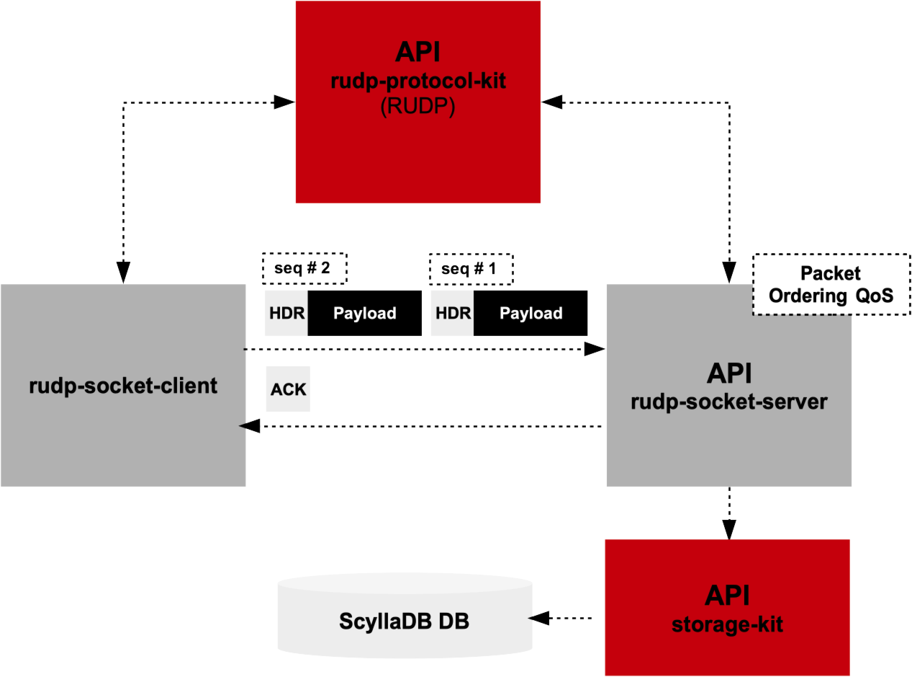

# RUDP Protocol Service (Go)
Go 1.23 Reliable UDP Network Protocol (Protocol Structures, Protocol API) Client-Server App w/ ScyllaDB Payload Storage





## Compiling the Project

To compile the project use the provided `Makefile`. The project includes a top-level `go.mod` file and subpackage `go.mod` files (packkage storage-kit has a go.mod)
and rudp-protocol-kit has a go.mod) to allow compiling their individual static libraries.

The project was created with a top-level go.mod file that controls the compilation for the entire project and looks as follows.

```shell
go mod init rudp-protocol-svc
```

This results in the following top-level project `go.mod` file. The `go mod tidy` command provides all the vendored dependencies.

```shell
module rudp-protocol-svc

go 1.23.1

require github.com/gocql/gocql v1.7.0

require (
	github.com/golang/snappy v0.0.3 // indirect
	github.com/hailocab/go-hostpool v0.0.0-20160125115350-e80d13ce29ed // indirect
	gopkg.in/inf.v0 v0.9.1 // indirect
)
```


The `go mod init` is required for subpackage `storage-kit` as follows.
The go.mod file for storage-kit was created as follows.

```shell
cd storage-kit
go mod init rudp-protocol-svc/storage-kit
```

The `go mod init` is required for the subpackage `rudp-protocol-kit` as follows.

```shell
cd rudp-protocol-kit
go mod init rudp-protocol-svc/storage-kit
```

The included Makefile is here as shown to compile the entire project or individual project package dependencies as Go static libraries (.a files).

```Makefile
# Variables
PROJECT_NAME := rudp-protocol-svc
CLIENT_DIR := ./rudp-socket-client
SERVER_DIR := ./rudp-socket-server
RUDP_PROTOCOL_DIR := ./rudp-protocol-kit
STORAGE_KIT_DIR := ./storage-kit

DOCKER_COMPOSE := docker-compose.yml
GO := go
GO_VERSION := 1.23
IMAGE_TAG := latest

# Commands
DOCKER_COMPOSE_CMD := docker-compose -f $(DOCKER_COMPOSE)
GO_BUILD_CMD := $(GO) build
GO_TEST_CMD := $(GO) test
GO_LINT_CMD := golangci-lint run
GO_FMT_CMD := gofmt -w

# Phony targets to avoid confusion with actual files
.PHONY: all client server protocol storage build-client build-server build lint fmt test clean docker-build-client docker-build-server up down

# Default target: build and run everything
all: lint test build docker-build up

# Build the client
client:
	@echo "Building the client binary..."
	cd $(CLIENT_DIR) && $(GO_BUILD_CMD) -o client main.go

# Build the server
server:
	@echo "Building the server binary..."
	cd $(SERVER_DIR) && $(GO_BUILD_CMD) -o server main.go

# Build the protocol library
protocol:
	@echo "Building the RUDP protocol kit..."
	cd $(RUDP_PROTOCOL_DIR) && $(GO_BUILD_CMD) -o rudp-protocol-kit rudp.go

# Build the storage library
storage:
	@echo "Building the storage kit..."
	cd $(STORAGE_KIT_DIR) && $(GO_BUILD_CMD) -o storage-kit storage.go

# Build all binaries (client, server, protocol, storage)
build: client server protocol storage
	@echo "Build complete."

# Lint the Go codebase
lint:
	@echo "Running Go lint..."
	$(GO_LINT_CMD) $(CLIENT_DIR) $(SERVER_DIR) $(RUDP_PROTOCOL_DIR) $(STORAGE_KIT_DIR)

# Format Go code
fmt:
	@echo "Formatting Go code..."
	$(GO_FMT_CMD) $(CLIENT_DIR) $(SERVER_DIR) $(RUDP_PROTOCOL_DIR) $(STORAGE_KIT_DIR)

# Run unit tests
test:
	@echo "Running tests..."
	$(GO_TEST_CMD) ./... -v

# Clean up build artifacts
clean:
	@echo "Cleaning up binaries and Docker artifacts..."
	rm -rf $(CLIENT_DIR)/client $(SERVER_DIR)/server
	$(DOCKER_COMPOSE_CMD) down --rmi all --volumes --remove-orphans

# Docker build for client
docker-build-client:
	@echo "Building Docker image for client..."
	docker build -t $(PROJECT_NAME)-client:$(IMAGE_TAG) -f $(CLIENT_DIR)/Dockerfile.client .

# Docker build for server
docker-build-server:
	@echo "Building Docker image for server..."
	docker build -t $(PROJECT_NAME)-server:$(IMAGE_TAG) -f $(SERVER_DIR)/Dockerfile.server .

# Build both client and server Docker images
docker-build: docker-build-client docker-build-server
	@echo "Docker build complete."

# Bring up the Docker Compose services
up: docker-build
	@echo "Starting the Docker services..."
	$(DOCKER_COMPOSE_CMD) up --build

# Bring down the Docker Compose services
down:
	@echo "Stopping the Docker services..."
	$(DOCKER_COMPOSE_CMD) down
```


## Run the Project

```shell
docker-compose up --build
```

## Project Structure
